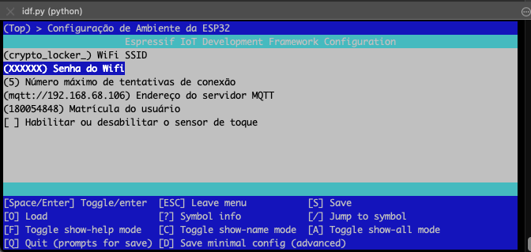

# FSE - Projeto 3

## Dupla

| Aluno                           | Matricula |
|---------------------------------|-----------|
| Daniel Maike Mendes Goncalves   | 160117003 |
| Rhuan Carlos Pereira de Queiroz | 180054848 |

## Enunciado

* https://gitlab.com/fse_fga/projetos_2021_1/projeto-final-2021-1

## Solução


Utilizamos ESP IDF nativo ESP-IDF v4.4-dev-3401-gb86fe0c66c

## Repositórios

Este repositório contém os submodulos do Servidor Central, Frontend e ESP32, com um docker-compose para subir os serviços, apenas o código da ESP32 irá subir separadamente.

Optamos por subir o broker mosquitto local para não depender do mosquitto online.

* Servidor Central: https://github.com/FSE-2021-1/central-server

* Frontend: https://github.com/FSE-2021-1/frontend

* ESP32: https://github.com/FSE-2021-1/esp32

## Execução

### Pré requisitos

* Instalar docker e docker-compose

* Configurar o esp-idf, documentação disponível em: https://docs.espressif.com/projects/esp-idf/en/latest/esp32/get-started/index.html

### Configuração

É necessário configurar as credenciais da WI-FI e o endereço do servidor MQTT

```
idf.py menuconfig
```





### Deploy local dos serviços

Para executar basta clonar este projeto com os submódulos:

```
git clone --recursive https://github.com/FSE-2021-1/final-project.git
```

E para executar o Servidor Central, Broker Mosquitto e o Frontend

```
docker-compose up --build
```

Para executar o código da ESP32

```
idf.py -p <PORTA_ESP32> erase_flash
```

```
idf.py -p <PORTA_ESP32>  build
```

```
idf.py -p <PORTA_ESP32> flash monitor
```

* erase_flash: limpar a flash para que a ESP32 faça o registro obrigatoriamente (a flash é utilizada para não uma ESP32 já registrada anteriormente não se registrar novamente)

## Logs

### Exemplo de logs com acionamento do alarme


CSV de exemplo: ./log_1636329877724.csv

## Demonstração

Cadastro


LED PWM


Botão e Alarme


Ao apertar o botão o alarme é acionado (alarme.mp3 dentro de /frontend/src), ou é possível acionar ele manualmente

E o vídeo está presente em ./assets/Trabalho-Final.mp4